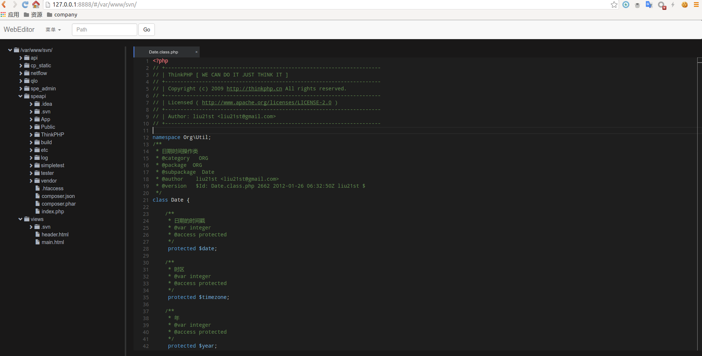

webeditor一个开源的web开发IDE.其设计思想是简单,易用
# 特性
* 项目树显示
* 文件操作(创建,删除,重命名)
* 支持 js,php,go,c,java,json,lua,ruby,py等等语言的高亮显示和代码提示
* 代码编辑和保存

#Install
git clone https://github.com/suxiaoxin/webeditor.git   
cd webeditor   
npm install   
npm start   

#Useage
http://ip:8888

#未来计划推出的功能： 
1. 项目搜索功能
2. 允许多用户同步编辑。
3. 代码比较功能

